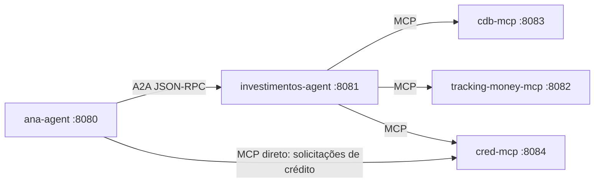
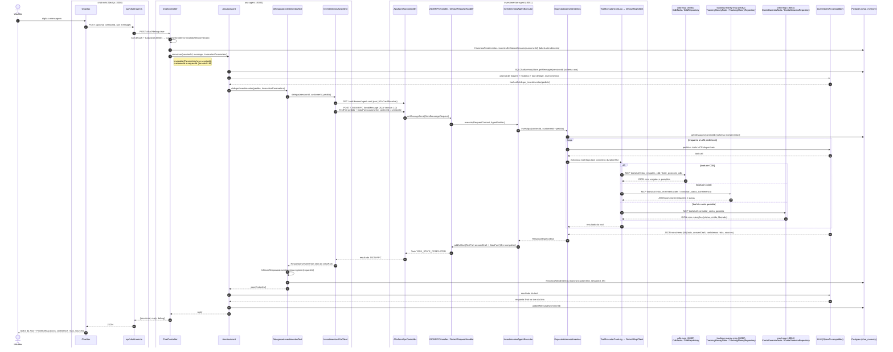

# POC Agent-to-Agent — Ana → Investimentos → MCP

Valida, em Java 25 + Spring Boot 4, a delegação **Supervisor → Especialista via A2A 1.0** e **Especialista → tools via MCP**.
Design: `docs/superpowers/specs/2026-09-22-a2a-poc-design.md`.

```
cliente ─POST /chat─▶ ana-agent:8080 ─A2A JSON-RPC─▶ investimentos-agent:8081 ─MCP─▶ cdb-mcp:8083
                          │                                                    └─MCP─▶ tracking-money-mcp:8082
                          │                                                    └─MCP─▶ cred-mcp:8084
                          └─MCP (McpClient direto, solicitações de crédito)─────────────▶ cred-mcp:8084
```


UI


## Rodando

> Passo a passo completo para testar e explorar (LLM, chat web, hops, falhas): [docs/GUIA-TESTES.md](docs/GUIA-TESTES.md).

### Rodar para explorar (caminho rápido, LLM local e grátis)

Pré-requisitos: Docker rodando, JDK 25 (`$HOME/.sdkman/candidates/java/25.0.2-tem`, ou `make JAVA_HOME=...`), Maven,
Node 24 + npm, `jq` e o **Ollama** (o LLM que a Ana e o especialista usam).

```bash
brew install ollama                  # ou https://ollama.com/download
ollama serve                         # deixe rodando em outro terminal (se o app do Ollama já estiver aberto, pule)
ollama pull qwen2.5:7b               # só na primeira vez (~4,7 GB)
cp .env.llm-local.example .env       # já aponta para o Ollama, sem chave
make up                              # build + compose; espera todos healthy
```

Abra **http://localhost:3000**, clique num dos **CPFs de teste** (ex.: `888.008.008-31`, resgate retido parcialmente) e
escreva "meu dinheiro sumiu" → "estava em investimentos". Depois clique em **Nova conversa** e diga "oi, voltei": a
Ana lembra do atendimento anterior. Para a jornada de crédito, use 999.009.009-28 e pergunte "minha solicitação de
empréstimo foi recusada, por quê?". Para conferir tudo de uma vez: `make smoke`. Para parar: `make down`.

> Prefere OpenAI ou um gateway em vez do Ollama? `cp .env.example .env` e preencha `LLM_BASE_URL` / `LLM_API_KEY` /
> `LLM_MODEL`. Modelos pequenos (7b) às vezes erram o tool calling; se a Ana não delegar, tente `qwen3:8b` ou maior.

### Todos os comandos

```bash
make test               # só unitários (rápido, sem Docker nem LLM real)
make test-integration   # Postgres + Ollama em containers (Testcontainers); não usa o Ollama local — ver abaixo
make up                 # build + compose, espera todos healthy — o chat fica em http://localhost:3000
make smoke              # jornada completa para os 8 CPFs de teste + retorno
make smoke-falha        # derruba o especialista e confere o fallback da Ana
make logs               # hops: ana.chat, ana.tool.delegar_investimentos, a2a.task.*, mcp.tool.call
make down
make test-web          # frontend: typecheck + lint + vitest
make run-web           # chat web em http://localhost:3000 (next dev), Ana em localhost:8080
```

### Rodar e explorar localmente (fora do Docker)

Para depurar um serviço na IDE/terminal sem subir o compose inteiro — Postgres do compose + `mvn spring-boot:run`
(não usa Testcontainers):

```bash
make db-up              # só o Postgres do compose (localhost:55432, schemas ana/investimentos)
make run-mcps           # cdb-mcp :8083 + tracking-money-mcp :8082 + cred-mcp :8084, saída prefixada, Ctrl+C encerra
make run-investimentos  # :8081 (db-up + carrega .env); precisa dos MCPs no ar
make run-ana            # :8080 (db-up + carrega .env); delega para localhost:8081
make db-down            # para o Postgres (mantém os dados)
make db-reset           # remove o container e o volume anônimo do Postgres (init.sql roda de novo)
```

Fora do Docker, `LLM_BASE_URL` precisa ser alcançável **a partir do host**: para Ollama nativo use
`http://localhost:11434/v1`, não `http://host.docker.internal:11434/v1` (esse nome só existe dentro dos containers).

## Testes de integração (Testcontainers)

Mesmo padrão do projeto de referência `analizza-auction`, adaptado a projetos Maven de módulo único:

- **Separação por tag JUnit** no mesmo `src/test/java`: o surefire exclui `@Tag("integration")` por padrão
  (`make test` / `mvn test`); o profile Maven `integration-test` roda só essa tag
  (`make test-integration` = `mvn -P integration-test test` em `investimentos-agent` e `ana-agent`).
- **`BaseIntegrationTest`** por agente (pacote base): `@SpringBootTest(RANDOM_PORT)` com a aplicação real, **sem**
  profile `test` (os beans de `AnaConfig` / `EspecialistaConfig` carregam de verdade), containers singleton estáticos
  iniciados de forma eager (sem `@Container`/`@Testcontainers`/`@ServiceConnection`/`withReuse`), ligação por
  `@DynamicPropertySource` (`memoria.*`, `llm.*`) e `RestTestClient` na porta aleatória. Um `@BeforeEach` limpa `chat_memory`.
- **Reais**: Postgres (`postgres:17-alpine`, a mesma imagem do compose; schema `public`) e o LLM, via Ollama
  (`ollama/ollama:0.34.3` + modelo `qwen2.5:3b`, troque com `IT_OLLAMA_MODEL=...`).
- **Dublados** (outros sistemas): na Ana, `InvestimentosClient` com `@MockitoBean`; no especialista, os dois
  `McpClient` (conectam no construtor) com `@MockitoBean` por nome e o `mcpToolProvider` trocado por um fake com os 4
  nomes de tool reais e respostas copiadas dos mocks dos MCP servers (cli-001), ainda decorado pelo `ToolProviderComLog`.
- **Nomenclatura**: `<Entrypoint>IT extends BaseIntegrationTest` (`ChatControllerIT`, `A2aJsonRpcControllerIT`).
  A regra ArchUnit `architecture/EntrypointHasIntegrationTestRuleIT` (`FreezingArchRule`, store em
  `<projeto>/archunit_store`, versionar após a primeira execução) falha se um `@RestController`/`@Scheduled` novo não tiver IT.
- As asserções toleram um modelo pequeno: status, schema §9, `confidence` em [0,1], memória persistida no Postgres e
  o `customerId` vindo do request (nunca do LLM) — não comparam o texto gerado.

**Primeira execução** (precisa de Docker rodando) baixa: `postgres:17-alpine` (~100MB, se ainda não estiver local),
`ollama/ollama:0.34.3` (~3,7GB comprimido em amd64, ~2,8GB em arm64), o modelo `qwen2.5:3b` (~2GB, via `ollama pull`
dentro do container) e `testcontainers/ryuk:0.12.0` (se ainda não estiver local). Depois do pull, o container é gravado como a imagem local
`tc-ollama-qwen2.5-3b` (`OllamaContainer.commitToImage`) e as execuções seguintes sobem direto dela, sem baixar o
modelo de novo. Para refazer o cache: `docker rmi tc-ollama-qwen2.5-3b`. Inferência em CPU é lenta (minutos por
teste); por isso o timeout do `ChatModel` é configurável (`llm.timeout`, default 60s; 300s nos ITs).

## Dois jeitos de consumir MCP (para comparar)

| | Ana → cred-mcp (`consultar_solicitacoes_credito`) | investimentos-agent → cdb/tracking/cred |
|---|---|---|
| Classe | `McpClient` + `@Tool` Java (`ConsultaCreditoTool` → `CredMcpSolicitacoesCredito`) | `McpToolProvider` (`EspecialistaConfig.provedorMcp`) |
| Tool vista pelo LLM | `consultar_solicitacoes_credito()` sem parâmetros | as tools do servidor, com `customerId` |
| Quem preenche `customerId` | Java, de `InvocationParameters` (CPF → cadastro) | o LLM, copiando do pedido A2A |
| Retorno ao LLM | texto montado em Java, **sem** `motivoCodigo` | JSON cru do MCP |
| Falha | `INDISPONIVEL` determinístico + histórico + debug | erro da tool volta ao LLM (vira `risks`) |
| Tool nova no servidor | exige um método Java | aparece sozinha (aqui filtrada por `filterToolNames`) |

Os dois são tool calling; muda quem implementa a tool que o LLM enxerga. Spec: `docs/superpowers/specs/2026-09-23-ana-credito-solicitacoes-design.md`.

## Fluxo ponta a ponta

Turno 2 da jornada ("estava em investimentos e não encontro"), do navegador até os MCP servers e de volta. No turno 1 ("meu dinheiro sumiu") o LLM da Ana responde direto, sem chamar a tool: os passos da delegação não acontecem e `debug` volta `null`.



Se o especialista estiver fora, der timeout (90s) ou a Task terminar diferente de `COMPLETED`, o `InvestimentosA2aClient` lança `InvestimentosIndisponivelException`. A `DelegacaoInvestimentosTool` a converte em `INDISPONIVEL: ...`, e a Ana responde "não consegui consultar seus investimentos agora", sem 5xx. Se a Ana estiver fora, o BFF responde 502 e o chat mostra um aviso.

## Objetos do fluxo

| Objeto | App | Como funciona |
|---|---|---|
| `Chat` (`components/Chat.tsx`) | chat-web | Client component. Guarda a conversa em memória, gera o `sessionId` com `crypto.randomUUID()`, pede o CPF (campo + lista "CPFs de teste" que preenche e inicia), permite trocar o cliente (nova sessão) e chama `POST /api/chat`. Mostra "Ana está digitando…" e avisos de erro. |
| `PainelDebug` (`components/PainelDebug.tsx`) | chat-web | Um item por turno. Mostra o retorno do especialista (barra de `confidence`, `facts`, `risks`, `sources`, bloco **Conta garantia** quando há `situacaoGarantia`) ou "sem delegação" quando `debug` é `null`. |
| `POST /api/chat` (`app/api/chat/route.ts`) | chat-web | BFF: repassa o corpo para `${ANA_URL}/chat?debug=true` com timeout de 120s. Erro de rede, timeout, 5xx, qualquer não-2xx diferente de 400 e 2xx com corpo não-JSON viram 502 com mensagem amiga; só 400 da Ana é repassado como 400, com o `error` da Ana. O navegador nunca fala com a Ana. |
| `GET /api/health` (`app/api/health/route.ts`) | chat-web | Healthcheck do container (`{"status":"UP"}`). |
| `ChatController` | ana-agent | `POST /chat`. Valida os campos, resolve o CPF em `customerId` (400 se inválido/desconhecido), injeta o histórico de outras sessões no prompt, monta os `InvocationParameters` (`sessionId`, `customerId`, `requestId`), chama o `AnaAssistant` e, com `?debug=true`, anexa o §9 do turno. |
| `AnaAssistant` (criado por `AnaFactory`) | ana-agent | AI Service do LangChain4j: prompt de triagem (`prompts/ana-system.txt`), memória por `sessionId` e uma única tool, `delegar_investimentos`. |
| `Cpf` / `CadastroClientes` | ana-agent | Valida o CPF (dígitos verificadores) e resolve `customerId` num cadastro mock. O CPF só aparece mascarado em log e não vai ao LLM, à memória nem ao A2A. |
| `HistoricoAtendimentos` / `JdbcHistoricoAtendimentos` | ana-agent | Um registro por delegação bem-sucedida na tabela `atendimento` (por `customerId`). O `ChatController` injeta os 3 mais recentes de outras sessões no system prompt (`@V("atendimentosAnteriores")`), formatados pelo `FormatadorAtendimentos`. |
| `SituacaoGarantia` | investimentos-agent e ana-agent | Campo opcional do §9 (`status`, `valorResgatado`, `valorRetido`, `valorLiberado`, `proximoPasso`). O executor A2A descarta valores inconsistentes e registra em `risks`. |
| `ContaGarantiaTools` / `ContaGarantiaRepository` | cred-mcp | Tool `consultar_conta_garantia` (`customerId`): retenções em conta garantia por gastos no cartão, com dados mock em memória. |
| `DelegacaoInvestimentosTool` | ana-agent | `@Tool delegar_investimentos`. Lê `customerId` e `sessionId` dos `InvocationParameters` (nunca do LLM), chama o cliente A2A, registra o §9 para o debug e devolve texto ao LLM, ou `INDISPONIVEL:` em caso de falha. |
| `UltimasRespostasInvestimentos` | ana-agent | Guarda o §9 por `requestId` durante a requisição, para o `ChatController` devolver no `debug`. |
| `InvestimentosA2aClient` | ana-agent | Cliente a2a-java. Resolve o Agent Card a cada chamada, envia `SendMessage` (TextPart + DataPart `customerId`, `contextId = sessionId`), impõe timeout de 90s com cancelamento e extrai o DataPart §9 da Task. |
| `SQLChatMemoryStore` (em `AnaConfig`) | ana-agent | Memória de chat da Ana no Postgres (schema `ana`, tabela `chat_memory`), por `sessionId`. |
| `A2aJsonRpcController` | investimentos-agent | Ponte Spring MVC do servidor A2A: `GET /.well-known/agent-card.json` e `POST /` (JSON-RPC 2.0). Os corpos trafegam como String e o SDK serializa. |
| `A2aServerConfig` | investimentos-agent | Monta o servidor a2a-java sem CDI (AgentCard, TaskStore e QueueManager em memória, MainEventBusProcessor, executores). Eleva o timeout do SDK de 5s para 60s via `RequestHandlerTimeouts`. |
| `JSONRPCHandler` / `DefaultRequestHandler` | investimentos-agent (SDK a2a-java) | Ciclo de vida da Task: cria, enfileira, executa o `AgentExecutor` e agrega os eventos até o estado final. |
| `InvestimentosAgentExecutor` | investimentos-agent | `AgentExecutor`. Extrai o `customerId` do DataPart, chama o especialista com a memória do `contextId`, publica o artifact `[TextPart, DataPart §9]` e dá `complete()`, ou `fail()` em caso de erro. |
| `EspecialistaInvestimentos` (criado por `EspecialistaFactory`) | investimentos-agent | AI Service com as tools MCP. Decide sozinho quais tools chamar (autonomia do especialista) e devolve `RespostaEspecialista` no schema §9. |
| `ToolProviderComLog` / `McpToolProvider` | investimentos-agent | A cada chamada do especialista (`investigar`), descobre as tools dos três MCP servers (Streamable HTTP em `/mcp`) e envolve o executor de cada uma com `ToolExecutorComLog`. |
| `ToolExecutorComLog` / `DefaultMcpClient` | investimentos-agent | Em cada chamada de tool feita pelo LLM: loga tool, `contextId` (memoryId) e duração, e executa a chamada MCP `tools/call` via `DefaultMcpClient`; erros sobem inalterados para o LangChain4j devolver ao LLM. |
| `SQLChatMemoryStore` (em `EspecialistaConfig`) | investimentos-agent | Memória do especialista no Postgres (schema `investimentos`), por `contextId` A2A. |
| `CdbTools` / `CdbRepository` | cdb-mcp | Tools `listar_posicoes_cdb` e `listar_resgates_cdb` (entrada `customerId`, JSON Schema estrito), com dados mock em memória. |
| `TrackingMoneyTools` / `TrackingMoneyRepository` | tracking-money-mcp | Tools `listar_movimentacoes` (`customerId`) e `consultar_status_transferencia` (`transferenciaId`), com dados mock em memória. |
| `McpServerConfig` | cdb-mcp, tracking-money-mcp e cred-mcp | Registra o servlet `HttpServletStreamableServerTransportProvider` em `/mcp` e o `McpSyncServer` com as tools. |
| LLM | externo | Endpoint compatível com OpenAI configurado por `LLM_BASE_URL`, `LLM_API_KEY` e `LLM_MODEL`, usado pela Ana e pelo especialista. |
| Postgres | infra (compose) | Uma instância com os schemas `ana` e `investimentos`; `ana` tem `chat_memory` e `atendimento`, `investimentos` tem `chat_memory`. |

## Conversa manual

```bash
curl -s -X POST 'localhost:8080/chat?debug=true' -H 'Content-Type: application/json' \
  -d '{"sessionId":"s1","cpf":"111.001.001-05","message":"meu dinheiro sumiu"}' | jq
curl -s -X POST 'localhost:8080/chat?debug=true' -H 'Content-Type: application/json' \
  -d '{"sessionId":"s1","cpf":"111.001.001-05","message":"estava em investimentos e agora nao consigo encontrar"}' | jq
curl -s localhost:8081/.well-known/agent-card.json | jq
```

## Cenários mock

| CPF | customerId | Situação | Esperado |
|---|---|---|---|
| 111.001.001-05 | cli-001 | Resgate CDB em liquidação, crédito processando | "em liquidação, aguarde alguns minutos" |
| 222.002.002-93 | cli-002 | Resgate liquidado, crédito na conta | "já está na sua conta" |
| 333.003.003-80 | cli-003 | CDB ativo, sem resgate | "continua aplicado" |
| 444.004.004-76 | cli-004 | Nada encontrado | confidence < 0.5, encaminha para humano |
| 555.005.005-62 | cli-005 | Resgate passou pela conta garantia e foi liberado | `LIBERADO_CONTA`, "já está na sua conta" |
| 666.006.006-59 | cli-006 | Resgate na conta garantia em análise (gastos no cartão) | `EM_ANALISE`, "em análise, sem prazo" |
| 777.007.007-45 | cli-007 | Resgate retido até pagar a fatura (gasto R$ 12.000) | `RETIDO_ATE_PAGAMENTO_FATURA`, fatura vence 05/10 |
| 888.008.008-31 | cli-008 | Gasto R$ 3.500: R$ 6.500 liberados, R$ 3.500 retidos | `RETIDO_PARCIAL` |

Voltar depois: com o mesmo CPF, clique em **Nova conversa** — a Ana abre lembrando do atendimento anterior (tabela `ana.atendimento`).

## Achados técnicos (Spring Boot + a2a-java)

- O servidor a2a-java é CDI/Quarkus; em Spring foi preciso um controller-ponte (`A2aJsonRpcController`) e wiring manual (`A2aServerConfig`).
- O builder do `DefaultRequestHandler` fixa timeout de 5s para o agente — elevado para 60s via `RequestHandlerTimeouts`.
- `@A2AClientAgent` (LangChain4j) descarta DataParts e resolve o Agent Card no startup; a Ana usa o client do a2a-java como `@Tool`.
- Protocolo A2A 1.0: método `SendMessage`, header `A2A-Version: 1.0` obrigatório.
- Dentro do especialista, o LLM copia o customerId para os argumentos das tools MCP; em produção, vincular o customerId no servidor (ex.: decorator do ToolProvider por contextId) para evitar consulta a outro cliente via prompt injection.
- `GetTask`/`ListTasks` do servidor A2A ficam expostos sem autenticação (`authorizationRequired(false)` em `A2aServerConfig`, porta 8081 publicada no compose); em produção, habilitar um `TaskAuthorizationProvider`/autenticação antes de expor a porta.
