# chat-web Implementation Plan

> **For agentic workers:** REQUIRED SUB-SKILL: Use superpowers:subagent-driven-development (recommended) or superpowers:executing-plans to implement this plan task-by-task. Steps use checkbox (`- [ ]`) syntax for tracking.

**Goal:** A Next.js frontend in `agent-to-agent/chat-web/` to chat with the Ana and see the A2A delegation (specialist §9 payload) in a debug panel, runnable via `make up` (compose) and `make run-web` (dev), plus README docs with an end-to-end Mermaid flow and an object table.

**Architecture:** Next.js App Router app. The browser only talks to the app's own route handler `POST /api/chat`, which proxies (BFF) to `${ANA_URL}/chat?debug=true`. A client component (`Chat`) holds the conversation in memory and a `PainelDebug` shows one item per turn. Docker image uses Next `output: "standalone"`.

**Tech Stack:** Next.js 16.3.6, React 19.2.8, TypeScript 5, ESLint 9 (eslint-config-next 16.3.6), Vitest 5 + jsdom + Testing Library, Node 24 (Docker) / local Node ≥ 20.

**Spec:** `agent-to-agent/docs/superpowers/specs/2026-09-23-chat-web-design.md`

## Global Constraints

- Folder: `agent-to-agent/chat-web/` (repo root is `ai-demos/`; all paths below are relative to `agent-to-agent/`).
- Next.js `16.3.6`, `react`/`react-dom` `19.2.8`, `eslint-config-next` `16.3.6`, `@types/node` `^24` (vitest 5 peer-requires it).
- The browser never calls the Ana directly: only `POST /api/chat` (BFF) → `${ANA_URL}/chat?debug=true`. `ANA_URL` is server-side only, default `http://localhost:8080`; compose uses `http://ana-agent:8080`.
- Proxy errors: network error or Ana status ≥ 500 → `502 {"error":"A Ana está indisponível no momento. Tente novamente em instantes."}`; other non-2xx → `400 {"error":"Requisição inválida."}`. Proxy timeout 120s.
- `GET /api/health` → `200 {"status":"UP"}`.
- Clients: `cli-001` "Resgate de CDB em liquidação", `cli-002` "Resgate liquidado, crédito na conta", `cli-003` "CDB ativo, sem resgate", `cli-004` "Nada encontrado".
- State only in browser memory; new `sessionId` via `crypto.randomUUID()` on "Nova conversa" and on client change.
- Every commit message ends with `Co-Authored-By: Claude Opus 5.5 <noreply@anthropic.com>`. Git repo root is `/Users/diegolirio/Documents/Github/ai-demos` (branch `main`, remote origin — do not push).
- The code below was validated in a throwaway spike (typecheck, lint, 10 tests, standalone build, route smoke all green). Copy it verbatim.

## File Structure

```
chat-web/
├── .dockerignore, .gitignore, Dockerfile           # Task 1 (.gitignore from create-next-app), Task 3 (Docker)
├── package.json, package-lock.json                 # Task 1
├── next.config.ts, tsconfig.json, eslint.config.mjs  # Task 1 (next.config edited; others from create-next-app)
├── vitest.config.mts, vitest.setup.ts              # Task 1
├── lib/tipos.ts        # contracts (ChatRequisicao, ChatResposta, RespostaEspecialista, ErroResposta)   Task 1
├── lib/mensagens.ts    # user-facing error strings                                                   Task 1
├── lib/clientes.ts     # the 4 mock customers                                                         Task 2
├── app/api/chat/route.ts (+ route.test.ts)         # BFF proxy                                       Task 1
├── app/api/health/route.ts (+ route.test.ts)       # healthcheck                                     Task 1
├── app/layout.tsx, app/page.tsx, app/globals.css   # shell                                           Task 2
└── components/Chat.tsx, PainelDebug.tsx, Chat.module.css (+ Chat.test.tsx)                           Task 2
Root: docker-compose.yml, Makefile, smoke-test.sh, README.md                                            Task 3
```

---

### Task 1: Scaffold chat-web and the BFF routes

**Files:**
- Create (scaffold): `chat-web/` via create-next-app; then delete `chat-web/public/`, `chat-web/app/page.module.css`, `chat-web/app/favicon.ico`, `chat-web/README.md`
- Modify: `chat-web/package.json` (name, scripts, devDependencies), `chat-web/next.config.ts`
- Create: `chat-web/vitest.config.mts`, `chat-web/vitest.setup.ts`, `chat-web/lib/tipos.ts`, `chat-web/lib/mensagens.ts`, `chat-web/app/api/health/route.ts`, `chat-web/app/api/chat/route.ts`
- Test: `chat-web/app/api/chat/route.test.ts`, `chat-web/app/api/health/route.test.ts`

**Interfaces:**
- Produces: types `ChatRequisicao`, `ChatResposta`, `RespostaEspecialista`, `ErroResposta` (`@/lib/tipos`); constants `MENSAGEM_ANA_INDISPONIVEL`, `MENSAGEM_REQUISICAO_INVALIDA` (`@/lib/mensagens`); HTTP `POST /api/chat`, `GET /api/health`; npm scripts `dev`, `build`, `start`, `lint`, `typecheck`, `test`. Consumed by Tasks 2 and 3.

- [ ] **Step 1: Scaffold the app**

```bash
cd agent-to-agent
npx -y create-next-app@16.3.6 chat-web --ts --eslint --app --no-tailwind --no-src-dir --no-react-compiler --no-agents-md --import-alias "@/*" --use-npm --disable-git --yes
cd chat-web
rm -rf public app/page.module.css app/favicon.ico README.md
npm i -D @types/node@^24 vitest @vitejs/plugin-react jsdom @testing-library/react @testing-library/dom @testing-library/jest-dom @testing-library/user-event
```

Then set `package.json` to exactly (keep the versions npm resolved in `devDependencies` if they differ only in patch level):

```json
{
  "name": "chat-web",
  "version": "0.1.0",
  "private": true,
  "scripts": {
    "dev": "next dev",
    "build": "next build",
    "start": "next start",
    "lint": "eslint",
    "typecheck": "next typegen && tsc --noEmit",
    "test": "vitest run"
  },
  "dependencies": {
    "next": "16.3.6",
    "react": "19.2.8",
    "react-dom": "19.2.8"
  },
  "devDependencies": {
    "@testing-library/dom": "^10.4.2",
    "@testing-library/jest-dom": "^7.0.1",
    "@testing-library/react": "^16.3.3",
    "@testing-library/user-event": "^14.6.7",
    "@types/node": "^24.13.6",
    "@types/react": "^19",
    "@types/react-dom": "^19",
    "@vitejs/plugin-react": "^6.1.1",
    "eslint": "^9",
    "eslint-config-next": "16.3.6",
    "jsdom": "^30.1.1",
    "typescript": "^5",
    "vitest": "^5.0.1"
  }
}
```

Run `npm install` after editing so `package-lock.json` matches.

- [ ] **Step 2: Config files**

`chat-web/next.config.ts`:
```ts
import type { NextConfig } from "next";

const nextConfig: NextConfig = {
  // Imagem Docker enxuta: .next/standalone traz só o necessário para "node server.js"
  output: "standalone",
};

export default nextConfig;
```

`chat-web/vitest.config.mts`:
```ts
import { fileURLToPath } from "node:url";
import react from "@vitejs/plugin-react";
import { defineConfig } from "vitest/config";

export default defineConfig({
  plugins: [react()],
  resolve: {
    alias: { "@": fileURLToPath(new URL(".", import.meta.url)) },
  },
  test: {
    environment: "jsdom",
    setupFiles: ["./vitest.setup.ts"],
  },
});
```

`chat-web/vitest.setup.ts`:
```ts
import "@testing-library/jest-dom/vitest";
import { cleanup } from "@testing-library/react";
import { afterEach } from "vitest";

afterEach(() => {
  cleanup();
});
```

`chat-web/lib/tipos.ts`:
```ts
/** Retorno do especialista no schema padrão (guideline §9), exposto pela Ana com ?debug=true. */
export type RespostaEspecialista = {
  facts: string[];
  answerDraft: string;
  confidence: number;
  risks: string[];
  sources: string[];
};

export type ChatRequisicao = {
  sessionId: string;
  customerId: string;
  message: string;
};

export type ChatResposta = {
  sessionId: string;
  reply: string;
  debug: RespostaEspecialista | null;
};

export type ErroResposta = {
  error: string;
};
```

`chat-web/lib/mensagens.ts`:
```ts
export const MENSAGEM_ANA_INDISPONIVEL = "A Ana está indisponível no momento. Tente novamente em instantes.";
export const MENSAGEM_REQUISICAO_INVALIDA = "Requisição inválida.";
```

Note: constants live in `lib/` because a Next route file may only export HTTP handlers/route config.

- [ ] **Step 3: Write the failing route tests**

`chat-web/app/api/chat/route.test.ts`:
```ts
// @vitest-environment node
import { afterEach, beforeEach, describe, expect, it, vi } from "vitest";
import { MENSAGEM_ANA_INDISPONIVEL, MENSAGEM_REQUISICAO_INVALIDA } from "@/lib/mensagens";
import { POST } from "./route";

const corpo = { sessionId: "s-1", customerId: "cli-001", message: "meu dinheiro sumiu" };

function requisicao() {
  return new Request("http://localhost:3000/api/chat", {
    method: "POST",
    headers: { "Content-Type": "application/json" },
    body: JSON.stringify(corpo),
  });
}

describe("POST /api/chat", () => {
  const fetchMock = vi.fn();

  beforeEach(() => {
    vi.stubGlobal("fetch", fetchMock);
    vi.stubEnv("ANA_URL", "http://ana:8080");
  });

  afterEach(() => {
    fetchMock.mockReset();
    vi.unstubAllGlobals();
    vi.unstubAllEnvs();
  });

  it("repassa o corpo para a Ana com debug=true e devolve a resposta", async () => {
    const respostaAna = {
      sessionId: "s-1",
      reply: "Seu dinheiro estava aplicado onde?",
      debug: null,
    };
    fetchMock.mockResolvedValue(Response.json(respostaAna));

    const resposta = await POST(requisicao());

    expect(resposta.status).toBe(200);
    expect(await resposta.json()).toEqual(respostaAna);
    const [url, init] = fetchMock.mock.calls[0];
    expect(url).toBe("http://ana:8080/chat?debug=true");
    expect(init.method).toBe("POST");
    expect(JSON.parse(init.body)).toEqual(corpo);
  });

  it("devolve 502 quando a Ana está fora do ar", async () => {
    fetchMock.mockRejectedValue(new TypeError("fetch failed"));
    vi.spyOn(console, "error").mockImplementation(() => {});

    const resposta = await POST(requisicao());

    expect(resposta.status).toBe(502);
    expect(await resposta.json()).toEqual({ error: MENSAGEM_ANA_INDISPONIVEL });
  });

  it("devolve 502 quando a Ana responde 5xx", async () => {
    fetchMock.mockResolvedValue(new Response("erro", { status: 500 }));

    const resposta = await POST(requisicao());

    expect(resposta.status).toBe(502);
    expect(await resposta.json()).toEqual({ error: MENSAGEM_ANA_INDISPONIVEL });
  });

  it("repassa 400 quando a Ana rejeita a requisição", async () => {
    fetchMock.mockResolvedValue(new Response("bad request", { status: 400 }));

    const resposta = await POST(requisicao());

    expect(resposta.status).toBe(400);
    expect(await resposta.json()).toEqual({ error: MENSAGEM_REQUISICAO_INVALIDA });
  });
});
```

`chat-web/app/api/health/route.test.ts`:
```ts
// @vitest-environment node
import { describe, expect, it } from "vitest";
import { GET } from "./route";

describe("GET /api/health", () => {
  it("responde UP", async () => {
    const resposta = GET();

    expect(resposta.status).toBe(200);
    expect(await resposta.json()).toEqual({ status: "UP" });
  });
});
```

- [ ] **Step 4: Run the tests to verify they fail**

Run: `cd chat-web && npx vitest run app/api`
Expected: FAIL — `Failed to resolve import "./route"` (route files don't exist yet).

- [ ] **Step 5: Implement the routes**

`chat-web/app/api/health/route.ts`:
```ts
export function GET() {
  return Response.json({ status: "UP" });
}
```

`chat-web/app/api/chat/route.ts`:
```ts
import { MENSAGEM_ANA_INDISPONIVEL, MENSAGEM_REQUISICAO_INVALIDA } from "@/lib/mensagens";

// Acima dos 90s de timeout A2A da Ana: quem desiste primeiro é a Ana, com resposta amigável
const TIMEOUT_MS = 120_000;

/** BFF: o navegador nunca fala direto com a Ana (sem CORS, URL da Ana fora do bundle). */
export async function POST(request: Request) {
  const anaUrl = process.env.ANA_URL ?? "http://localhost:8080";
  const corpo = await request.text();

  let resposta: Response;
  try {
    resposta = await fetch(`${anaUrl}/chat?debug=true`, {
      method: "POST",
      headers: { "Content-Type": "application/json" },
      body: corpo,
      cache: "no-store",
      signal: AbortSignal.timeout(TIMEOUT_MS),
    });
  } catch (erro) {
    console.error("chat-web: falha ao chamar a Ana", erro);
    return Response.json({ error: MENSAGEM_ANA_INDISPONIVEL }, { status: 502 });
  }

  if (resposta.status >= 500) {
    return Response.json({ error: MENSAGEM_ANA_INDISPONIVEL }, { status: 502 });
  }
  if (!resposta.ok) {
    return Response.json({ error: MENSAGEM_REQUISICAO_INVALIDA }, { status: 400 });
  }
  return Response.json(await resposta.json());
}
```

- [ ] **Step 6: Run the tests to verify they pass**

Run: `cd chat-web && npx vitest run app/api`
Expected: PASS — 5 tests (4 chat + 1 health).

- [ ] **Step 7: Commit**

```bash
cd /Users/diegolirio/Documents/Github/ai-demos
git add agent-to-agent/chat-web
git commit -m "feat(chat-web): scaffold Next.js e BFF /api/chat + /api/health"
```
(append the Co-Authored-By trailer; confirm `node_modules/` and `.next/` are not staged — `chat-web/.gitignore` from create-next-app covers them.)

---

### Task 2: Chat UI with debug panel

**Files:**
- Create: `chat-web/lib/clientes.ts`, `chat-web/components/PainelDebug.tsx`, `chat-web/components/Chat.tsx`, `chat-web/components/Chat.module.css`
- Modify (replace content): `chat-web/app/page.tsx`, `chat-web/app/layout.tsx`, `chat-web/app/globals.css`
- Test: `chat-web/components/Chat.test.tsx`

**Interfaces:**
- Consumes: `ChatResposta`, `ErroResposta`, `RespostaEspecialista` from `@/lib/tipos`; `MENSAGEM_ANA_INDISPONIVEL` from `@/lib/mensagens`; `POST /api/chat` (Task 1).
- Produces: `Chat` (named export, `@/components/Chat`), `PainelDebug` + type `TurnoDebug` (`@/components/PainelDebug`), `CLIENTES` (`@/lib/clientes`). Accessibility hooks used by tests: input label "Mensagem", button "Enviar", button "Nova conversa", select label "Cliente", list "Conversa", complementary "Debug do especialista", `data-testid="session-id"`, `data-testid="turno-debug"`, `data-autor` = `cliente|ana|sistema`.

- [ ] **Step 1: Write the failing component test**

`chat-web/components/Chat.test.tsx`:
```tsx
import { render, screen, within } from "@testing-library/react";
import userEvent from "@testing-library/user-event";
import { afterEach, beforeEach, describe, expect, it, vi } from "vitest";
import { MENSAGEM_ANA_INDISPONIVEL } from "@/lib/mensagens";
import { Chat } from "./Chat";

const fetchMock = vi.fn();

beforeEach(() => {
  vi.stubGlobal("fetch", fetchMock);
});

afterEach(() => {
  fetchMock.mockReset();
  vi.unstubAllGlobals();
});

async function enviar(texto: string) {
  const user = userEvent.setup();
  await user.type(screen.getByLabelText("Mensagem"), texto);
  await user.click(screen.getByRole("button", { name: "Enviar" }));
  return user;
}

describe("Chat", () => {
  it("envia a mensagem e mostra a resposta da Ana, sem delegação no debug", async () => {
    fetchMock.mockResolvedValue(
      Response.json({ sessionId: "s", reply: "Seu dinheiro estava aplicado onde?", debug: null }),
    );
    render(<Chat />);

    await enviar("meu dinheiro sumiu");

    const conversa = screen.getByRole("list", { name: "Conversa" });
    expect(within(conversa).getByText("meu dinheiro sumiu")).toHaveAttribute("data-autor", "cliente");
    expect(await within(conversa).findByText("Seu dinheiro estava aplicado onde?")).toHaveAttribute(
      "data-autor",
      "ana",
    );
    expect(screen.getByText("sem delegação")).toBeInTheDocument();

    const [url, init] = fetchMock.mock.calls[0];
    expect(url).toBe("/api/chat");
    const corpo = JSON.parse(init.body);
    expect(corpo.customerId).toBe("cli-001");
    expect(corpo.message).toBe("meu dinheiro sumiu");
    expect(corpo.sessionId).toBe(screen.getByTestId("session-id").textContent);
  });

  it("preenche o painel de debug quando a Ana delegou ao especialista", async () => {
    fetchMock.mockResolvedValue(
      Response.json({
        sessionId: "s",
        reply: "Seu resgate está em liquidação.",
        debug: {
          facts: ["Resgate res-001 de R$ 5000.00 EM_LIQUIDACAO"],
          answerDraft: "Seu resgate está em liquidação.",
          confidence: 0.9,
          risks: [],
          sources: ["cdb-mcp", "tracking-money-mcp"],
        },
      }),
    );
    render(<Chat />);

    await enviar("estava em investimentos");

    const painel = screen.getByRole("complementary", { name: "Debug do especialista" });
    expect(await within(painel).findByText("Resgate res-001 de R$ 5000.00 EM_LIQUIDACAO")).toBeInTheDocument();
    expect(within(painel).getByText("confidence 0.90")).toBeInTheDocument();
    expect(within(painel).getByText("tracking-money-mcp")).toBeInTheDocument();
    expect(within(painel).queryByText("sem delegação")).not.toBeInTheDocument();
  });

  it("mostra aviso quando a Ana está indisponível, mantendo o histórico", async () => {
    fetchMock.mockResolvedValue(Response.json({ error: MENSAGEM_ANA_INDISPONIVEL }, { status: 502 }));
    render(<Chat />);

    await enviar("oi");

    expect(await screen.findByText(MENSAGEM_ANA_INDISPONIVEL)).toHaveAttribute("data-autor", "sistema");
    expect(screen.getByText("oi")).toBeInTheDocument();
  });

  it("nova conversa limpa a tela e troca o sessionId", async () => {
    fetchMock.mockResolvedValue(Response.json({ sessionId: "s", reply: "olá", debug: null }));
    render(<Chat />);
    const user = await enviar("oi");
    await screen.findByText("olá");
    const sessaoAnterior = screen.getByTestId("session-id").textContent;

    await user.click(screen.getByRole("button", { name: "Nova conversa" }));

    expect(screen.queryByText("olá")).not.toBeInTheDocument();
    expect(screen.queryAllByTestId("turno-debug")).toHaveLength(0);
    expect(screen.getByTestId("session-id").textContent).not.toBe(sessaoAnterior);
  });

  it("trocar o cliente inicia nova conversa com o novo customerId", async () => {
    fetchMock.mockResolvedValue(Response.json({ sessionId: "s", reply: "olá", debug: null }));
    render(<Chat />);
    const sessaoAnterior = screen.getByTestId("session-id").textContent;

    const user = userEvent.setup();
    await user.selectOptions(screen.getByLabelText("Cliente"), "cli-003");
    await enviar("oi");

    expect(screen.getByTestId("session-id").textContent).not.toBe(sessaoAnterior);
    expect(JSON.parse(fetchMock.mock.calls[0][1].body).customerId).toBe("cli-003");
  });
});
```

- [ ] **Step 2: Run it to verify it fails**

Run: `cd chat-web && npx vitest run components`
Expected: FAIL — `Failed to resolve import "./Chat"`.

- [ ] **Step 3: Implement the UI**

`chat-web/lib/clientes.ts`:
```ts
/** Cenários mock da POC (mesmos customerIds dos MCP servers). */
export const CLIENTES = [
  { id: "cli-001", descricao: "Resgate de CDB em liquidação" },
  { id: "cli-002", descricao: "Resgate liquidado, crédito na conta" },
  { id: "cli-003", descricao: "CDB ativo, sem resgate" },
  { id: "cli-004", descricao: "Nada encontrado" },
] as const;
```

`chat-web/components/PainelDebug.tsx`:
```tsx
import type { RespostaEspecialista } from "@/lib/tipos";
import styles from "./Chat.module.css";

export type TurnoDebug = {
  id: number;
  mensagem: string;
  debug: RespostaEspecialista | null;
};

function Lista({ titulo, itens }: { titulo: string; itens: string[] }) {
  return (
    <div>
      <h4>{titulo}</h4>
      {itens.length === 0 ? (
        <p className={styles.vazio}>nenhum</p>
      ) : (
        <ul>
          {itens.map((item, i) => (
            <li key={i}>{item}</li>
          ))}
        </ul>
      )}
    </div>
  );
}

/** Um item por turno: mostra o retorno do especialista quando a Ana delegou via A2A. */
export function PainelDebug({ turnos }: { turnos: TurnoDebug[] }) {
  return (
    <aside className={styles.painel} aria-label="Debug do especialista">
      <h2>Especialista (A2A)</h2>
      {turnos.length === 0 && <p className={styles.vazio}>Nenhum turno ainda.</p>}
      {turnos.map((turno) => (
        <section key={turno.id} className={styles.turno} data-testid="turno-debug">
          <p className={styles.turnoMensagem}>“{turno.mensagem}”</p>
          {turno.debug === null ? (
            <p className={styles.semDelegacao}>sem delegação</p>
          ) : (
            <>
              <label className={styles.confianca}>
                confidence {turno.debug.confidence.toFixed(2)}
                <progress max={1} value={turno.debug.confidence} />
              </label>
              <Lista titulo="facts" itens={turno.debug.facts} />
              <Lista titulo="risks" itens={turno.debug.risks} />
              <Lista titulo="sources" itens={turno.debug.sources} />
            </>
          )}
        </section>
      ))}
    </aside>
  );
}
```

`chat-web/components/Chat.tsx`:
```tsx
"use client";

import { type FormEvent, useState } from "react";
import { CLIENTES } from "@/lib/clientes";
import { MENSAGEM_ANA_INDISPONIVEL } from "@/lib/mensagens";
import type { ChatResposta, ErroResposta } from "@/lib/tipos";
import styles from "./Chat.module.css";
import { PainelDebug, type TurnoDebug } from "./PainelDebug";

type Mensagem = {
  id: number;
  autor: "cliente" | "ana" | "sistema";
  texto: string;
};

let proximoId = 0;
const novoId = () => ++proximoId;

export function Chat() {
  const [customerId, setCustomerId] = useState<string>(CLIENTES[0].id);
  const [sessionId, setSessionId] = useState(() => crypto.randomUUID());
  const [mensagens, setMensagens] = useState<Mensagem[]>([]);
  const [turnos, setTurnos] = useState<TurnoDebug[]>([]);
  const [texto, setTexto] = useState("");
  const [enviando, setEnviando] = useState(false);

  function novaConversa(cliente: string = customerId) {
    setCustomerId(cliente);
    setSessionId(crypto.randomUUID());
    setMensagens([]);
    setTurnos([]);
  }

  async function enviar(evento: FormEvent) {
    evento.preventDefault();
    const mensagem = texto.trim();
    if (!mensagem || enviando) return;

    setTexto("");
    setEnviando(true);
    setMensagens((atuais) => [...atuais, { id: novoId(), autor: "cliente", texto: mensagem }]);
    try {
      const resposta = await fetch("/api/chat", {
        method: "POST",
        headers: { "Content-Type": "application/json" },
        body: JSON.stringify({ sessionId, customerId, message: mensagem }),
      });
      if (!resposta.ok) {
        const erro = (await resposta.json()) as ErroResposta;
        setMensagens((atuais) => [...atuais, { id: novoId(), autor: "sistema", texto: erro.error }]);
        return;
      }
      const dados = (await resposta.json()) as ChatResposta;
      setMensagens((atuais) => [...atuais, { id: novoId(), autor: "ana", texto: dados.reply }]);
      setTurnos((atuais) => [...atuais, { id: novoId(), mensagem, debug: dados.debug }]);
    } catch {
      setMensagens((atuais) => [...atuais, { id: novoId(), autor: "sistema", texto: MENSAGEM_ANA_INDISPONIVEL }]);
    } finally {
      setEnviando(false);
    }
  }

  return (
    <div className={styles.layout}>
      <main className={styles.principal}>
        <header className={styles.cabecalho}>
          <h1>Ana</h1>
          <label>
            Cliente
            <select value={customerId} onChange={(e) => novaConversa(e.target.value)}>
              {CLIENTES.map((cliente) => (
                <option key={cliente.id} value={cliente.id}>
                  {cliente.id} — {cliente.descricao}
                </option>
              ))}
            </select>
          </label>
          <button type="button" onClick={() => novaConversa()}>
            Nova conversa
          </button>
          <small className={styles.sessao} data-testid="session-id">
            {sessionId}
          </small>
        </header>

        <ol className={styles.mensagens} aria-label="Conversa">
          {mensagens.map((m) => (
            <li key={m.id} className={styles[m.autor]} data-autor={m.autor}>
              {m.texto}
            </li>
          ))}
          {enviando && <li className={styles.digitando}>Ana está digitando…</li>}
        </ol>

        <form className={styles.entrada} onSubmit={enviar}>
          <input
            aria-label="Mensagem"
            value={texto}
            onChange={(e) => setTexto(e.target.value)}
            placeholder="Escreva para a Ana…"
            disabled={enviando}
          />
          <button type="submit" disabled={enviando || !texto.trim()}>
            Enviar
          </button>
        </form>
      </main>
      <PainelDebug turnos={turnos} />
    </div>
  );
}
```

`chat-web/components/Chat.module.css`:
```css
.layout {
  display: grid;
  grid-template-columns: minmax(0, 2fr) minmax(280px, 1fr);
  height: 100vh;
}

.principal {
  display: flex;
  flex-direction: column;
  min-height: 0;
}

.cabecalho {
  display: flex;
  flex-wrap: wrap;
  gap: 12px;
  align-items: center;
  padding: 12px 16px;
  border-bottom: 1px solid #ddd;
}

.cabecalho h1 {
  margin: 0;
  font-size: 1.25rem;
}

.cabecalho label {
  display: flex;
  gap: 8px;
  align-items: center;
}

.sessao {
  color: #888;
  font-family: monospace;
}

.mensagens {
  flex: 1;
  overflow-y: auto;
  list-style: none;
  margin: 0;
  padding: 16px;
  display: flex;
  flex-direction: column;
  gap: 8px;
}

.cliente,
.ana,
.sistema,
.digitando {
  max-width: 75%;
  padding: 8px 12px;
  border-radius: 12px;
  white-space: pre-wrap;
}

.cliente {
  align-self: flex-end;
  background: #1f6feb;
  color: #fff;
}

.ana {
  align-self: flex-start;
  background: #f0f0f0;
}

.sistema {
  align-self: center;
  background: #fff4e5;
  color: #8a4b00;
  border: 1px solid #f5c27a;
}

.digitando {
  align-self: flex-start;
  color: #888;
  font-style: italic;
}

.entrada {
  display: flex;
  gap: 8px;
  padding: 12px 16px;
  border-top: 1px solid #ddd;
}

.entrada input {
  flex: 1;
  padding: 8px;
}

.painel {
  border-left: 1px solid #ddd;
  padding: 12px 16px;
  overflow-y: auto;
  background: #fafafa;
}

.painel h2 {
  margin-top: 0;
  font-size: 1rem;
}

.turno {
  border-bottom: 1px solid #e5e5e5;
  padding-bottom: 12px;
  margin-bottom: 12px;
}

.turno h4 {
  margin: 8px 0 4px;
  font-size: 0.85rem;
}

.turno ul {
  margin: 0;
  padding-left: 18px;
}

.turnoMensagem {
  font-style: italic;
  color: #555;
}

.confianca {
  display: flex;
  flex-direction: column;
  font-size: 0.85rem;
}

.semDelegacao,
.vazio {
  color: #888;
  font-size: 0.85rem;
}
```

`chat-web/app/page.tsx`:
```tsx
import { Chat } from "@/components/Chat";

export default function Home() {
  return <Chat />;
}
```

`chat-web/app/layout.tsx`:
```tsx
import type { Metadata } from "next";
import "./globals.css";

export const metadata: Metadata = {
  title: "Chat com a Ana",
  description: "POC Agent-to-Agent: Ana → A2A → Investimentos → MCP",
};

export default function RootLayout({ children }: Readonly<{ children: React.ReactNode }>) {
  return (
    <html lang="pt-BR">
      <body>{children}</body>
    </html>
  );
}
```

`chat-web/app/globals.css`:
```css
* {
  box-sizing: border-box;
}

html,
body {
  margin: 0;
  font-family: system-ui, sans-serif;
}
```

- [ ] **Step 4: Run the full web checks**

Run: `cd chat-web && npm run typecheck && npm run lint && npm test && npm run build`
Expected: typecheck OK, lint clean, `Tests 10 passed (10)`, build lists routes `/`, `/api/chat`, `/api/health` and creates `.next/standalone/server.js`.

- [ ] **Step 5: Commit**

```bash
cd /Users/diegolirio/Documents/Github/ai-demos
git add agent-to-agent/chat-web
git commit -m "feat(chat-web): tela de chat com a Ana e painel de debug do especialista"
```
(append the Co-Authored-By trailer)

---

### Task 3: Docker, compose, Makefile, smoke and README (with Mermaid flow)

**Files:**
- Create: `chat-web/Dockerfile`, `chat-web/.dockerignore`
- Modify: `docker-compose.yml` (new service), `Makefile` (targets + `.PHONY`), `smoke-test.sh` (web health check), `README.md` (new sections)

**Interfaces:**
- Consumes: `npm run build` standalone output and `GET /api/health` (Tasks 1–2); `ana-agent` compose service.
- Produces: compose service `chat-web` on `3000`; make targets `run-web`, `test-web`; `build` also builds the web app.

- [ ] **Step 1: Docker image**

`chat-web/Dockerfile`:
```dockerfile
FROM node:24-alpine AS deps
WORKDIR /app
COPY package.json package-lock.json ./
RUN npm ci

FROM node:24-alpine AS build
WORKDIR /app
COPY --from=deps /app/node_modules ./node_modules
COPY . .
RUN npm run build

FROM node:24-alpine
WORKDIR /app
ENV NODE_ENV=production \
    PORT=3000 \
    HOSTNAME=0.0.0.0
COPY --from=build /app/.next/standalone ./
COPY --from=build /app/.next/static ./.next/static
EXPOSE 3000
CMD ["node", "server.js"]
```

`chat-web/.dockerignore`:
```
node_modules
.next
npm-debug.log*
```

- [ ] **Step 2: Compose service** — append to `services:` in `docker-compose.yml` (after `ana-agent`, same indentation):

```yaml
  chat-web:
    build: ./chat-web
    ports:
      - "3000:3000"
    environment:
      # BFF: só o servidor Next fala com a Ana (rede do compose)
      ANA_URL: http://ana-agent:8080
    depends_on:
      ana-agent:
        condition: service_healthy
    healthcheck:
      <<: *healthcheck
      # node:24-alpine não tem curl; wget do busybox resolve
      test: ["CMD-SHELL", "wget -qO- http://localhost:3000/api/health >/dev/null || exit 1"]
```

Check: `LLM_API_KEY=dummy docker compose config -q` → exit 0.

- [ ] **Step 3: Makefile**

Add `run-web test-web` to the `.PHONY` line. Replace the `build` target with (recipe lines start with a TAB):

```make
build:
	@for s in $(SERVICES); do echo "==> build $$s"; (cd $$s && mvn -q -DskipTests package) || exit 1; done
	@echo "==> build chat-web"; cd chat-web && npm ci && npm run build
```

Add after the `test-integration` target:

```make
# Frontend: typecheck + lint + vitest (sem Docker, sem backend)
test-web:
	cd chat-web && npm ci && npm run typecheck && npm run lint && npm test
```

Add at the end of the "Rodar e explorar localmente" section:

```make
# Chat web em localhost:3000 (next dev), falando com a Ana em localhost:8080 (make run-ana ou make up)
run-web:
	cd chat-web && ([ -d node_modules ] || npm ci) && ANA_URL=$${ANA_URL:-http://localhost:8080} npm run dev
```

Check: `make -n build test-web run-web` prints the commands without errors.

- [ ] **Step 4: Smoke test** — in `smoke-test.sh`, add below the `ANA_URL=` line:

```bash
WEB_URL=${WEB_URL:-http://localhost:3000}
```

and add right before the line `cenario cli-001 "liquida"`:

```bash
echo "== chat-web"
curl -sf "$WEB_URL/api/health" >/dev/null; verificar "chat-web /api/health responde 200" $?
```

Check: `bash -n smoke-test.sh`.

- [ ] **Step 5: README** — in `README.md`:

(a) In the "Rodando" section list of make targets, add the lines:
```
make test-web          # frontend: typecheck + lint + vitest
make run-web           # chat web em http://localhost:3000 (next dev), Ana em localhost:8080
```
and after `make up` mention: "o chat fica em http://localhost:3000".

(b) Insert this new section right before `## Conversa manual`:

````markdown
## Fluxo ponta a ponta

Turno 2 da jornada ("estava em investimentos e não encontro"), do navegador até os MCP servers e de volta. No turno 1 ("meu dinheiro sumiu") o LLM da Ana responde direto, sem chamar a tool: os passos da delegação não acontecem e `debug` volta `null`.

```mermaid
sequenceDiagram
    autonumber
    actor U as Usuário
    box chat-web (Next.js :3000)
        participant CH as Chat.tsx
        participant BFF as api/chat/route.ts
    end
    box ana-agent (:8080)
        participant CC as ChatController
        participant AA as AnaAssistant
        participant DT as DelegacaoInvestimentosTool
        participant AC as InvestimentosA2aClient
    end
    box investimentos-agent (:8081)
        participant JR as A2aJsonRpcController
        participant RH as JSONRPCHandler / DefaultRequestHandler
        participant EX as InvestimentosAgentExecutor
        participant ES as EspecialistaInvestimentos
        participant TP as ToolProviderComLog / McpToolProvider
    end
    participant CDB as cdb-mcp (:8083)<br/>CdbTools / CdbRepository
    participant TM as tracking-money-mcp (:8082)<br/>TrackingMoneyTools / TrackingMoneyRepository
    participant LLM as LLM (OpenAI-compatible)
    participant PG as Postgres (chat_memory)

    U->>CH: digita a mensagem
    CH->>BFF: POST /api/chat {sessionId, customerId, message}
    BFF->>CC: POST /chat?debug=true
    CC->>AA: conversar(sessionId, message, InvocationParameters)
    Note right of CC: InvocationParameters leva sessionId,<br/>customerId e requestId (fora do LLM)
    AA->>PG: SQLChatMemoryStore.getMessages(sessionId) [schema ana]
    AA->>LLM: prompt de triagem + histórico + tool delegar_investimentos
    LLM-->>AA: tool call delegar_investimentos(pedido)
    AA->>DT: delegarInvestimentos(pedido, InvocationParameters)
    DT->>AC: delegar(sessionId, customerId, pedido)
    AC->>JR: GET /.well-known/agent-card.json (A2ACardResolver)
    AC->>JR: POST / JSON-RPC SendMessage (A2A-Version 1.0)<br/>TextPart pedido + DataPart customerId, contextId = sessionId
    JR->>RH: onMessageSend(SendMessageRequest)
    RH->>EX: execute(RequestContext, AgentEmitter)
    EX->>ES: investigar(contextId, customerId + pedido)
    ES->>PG: getMessages(contextId) [schema investimentos]
    loop enquanto o LLM pedir tools
        ES->>LLM: pedido + tools MCP disponíveis
        LLM-->>ES: tool call
        ES->>TP: executa a tool (loga tool, contextId, durationMs)
        alt tools de CDB
            TP->>CDB: MCP tools/call listar_resgates_cdb / listar_posicoes_cdb
            CDB-->>TP: JSON com resgates e posições
        else tools de conta
            TP->>TM: MCP tools/call listar_movimentacoes / consultar_status_transferencia
            TM-->>TP: JSON com movimentações e status
        end
        TP-->>ES: resultado da tool
    end
    LLM-->>ES: JSON no schema §9 (facts, answerDraft, confidence, risks, sources)
    ES-->>EX: RespostaEspecialista
    EX->>RH: addArtifact(TextPart answerDraft + DataPart §9) e complete()
    RH-->>JR: Task TASK_STATE_COMPLETED
    JR-->>AC: resultado JSON-RPC
    AC-->>DT: RespostaInvestimentos (lida do DataPart)
    DT->>DT: UltimasRespostasInvestimentos.registrar(requestId)
    DT-->>AA: paraTextoLlm()
    AA->>LLM: resultado da tool
    LLM-->>AA: resposta final no tom da Ana
    AA->>PG: updateMessages(sessionId)
    AA-->>CC: reply
    CC-->>BFF: {sessionId, reply, debug}
    BFF-->>CH: JSON
    CH-->>U: bolha da Ana + PainelDebug (facts, confidence, risks, sources)
```



Se o especialista estiver fora, der timeout (90s) ou a Task terminar diferente de `COMPLETED`, o `InvestimentosA2aClient` lança `InvestimentosIndisponivelException`. A `DelegacaoInvestimentosTool` a converte em `INDISPONIVEL: ...`, e a Ana responde "não consegui consultar seus investimentos agora", sem 5xx. Se a Ana estiver fora, o BFF responde 502 e o chat mostra um aviso.

## Objetos do fluxo

| Objeto | App | Como funciona |
|---|---|---|
| `Chat` (`components/Chat.tsx`) | chat-web | Client component. Guarda a conversa em memória, gera o `sessionId` com `crypto.randomUUID()`, permite trocar o cliente (nova sessão) e chama `POST /api/chat`. Mostra "Ana está digitando…" e avisos de erro. |
| `PainelDebug` (`components/PainelDebug.tsx`) | chat-web | Um item por turno. Mostra o retorno do especialista (barra de `confidence`, `facts`, `risks`, `sources`) ou "sem delegação" quando `debug` é `null`. |
| `POST /api/chat` (`app/api/chat/route.ts`) | chat-web | BFF: repassa o corpo para `${ANA_URL}/chat?debug=true` com timeout de 120s. Erro de rede ou 5xx vira 502 com mensagem amiga; outros erros viram 400. O navegador nunca fala com a Ana. |
| `GET /api/health` (`app/api/health/route.ts`) | chat-web | Healthcheck do container (`{"status":"UP"}`). |
| `ChatController` | ana-agent | `POST /chat`. Valida os campos, monta os `InvocationParameters` (`sessionId`, `customerId`, `requestId`), chama o `AnaAssistant` e, com `?debug=true`, anexa o §9 do turno. |
| `AnaAssistant` (criado por `AnaFactory`) | ana-agent | AI Service do LangChain4j: prompt de triagem (`prompts/ana-system.txt`), memória por `sessionId` e uma única tool, `delegar_investimentos`. |
| `DelegacaoInvestimentosTool` | ana-agent | `@Tool delegar_investimentos`. Lê `customerId` e `sessionId` dos `InvocationParameters` (nunca do LLM), chama o cliente A2A, registra o §9 para o debug e devolve texto ao LLM, ou `INDISPONIVEL:` em caso de falha. |
| `UltimasRespostasInvestimentos` | ana-agent | Guarda o §9 por `requestId` durante a requisição, para o `ChatController` devolver no `debug`. |
| `InvestimentosA2aClient` | ana-agent | Cliente a2a-java. Resolve o Agent Card a cada chamada, envia `SendMessage` (TextPart + DataPart `customerId`, `contextId = sessionId`), impõe timeout de 90s com cancelamento e extrai o DataPart §9 da Task. |
| `SQLChatMemoryStore` (em `AnaConfig`) | ana-agent | Memória de chat da Ana no Postgres (schema `ana`, tabela `chat_memory`), por `sessionId`. |
| `A2aJsonRpcController` | investimentos-agent | Ponte Spring MVC do servidor A2A: `GET /.well-known/agent-card.json` e `POST /` (JSON-RPC 2.0). Os corpos trafegam como String e o SDK serializa. |
| `A2aServerConfig` | investimentos-agent | Monta o servidor a2a-java sem CDI (AgentCard, TaskStore e QueueManager em memória, MainEventBusProcessor, executores). Eleva o timeout do SDK de 5s para 60s via `RequestHandlerTimeouts`. |
| `JSONRPCHandler` / `DefaultRequestHandler` | investimentos-agent (SDK a2a-java) | Ciclo de vida da Task: cria, enfileira, executa o `AgentExecutor` e agrega os eventos até o estado final. |
| `InvestimentosAgentExecutor` | investimentos-agent | `AgentExecutor`. Extrai o `customerId` do DataPart, chama o especialista com a memória do `contextId`, publica o artifact `[TextPart, DataPart §9]` e dá `complete()`, ou `fail()` em caso de erro. |
| `EspecialistaInvestimentos` (criado por `EspecialistaFactory`) | investimentos-agent | AI Service com as tools MCP. Decide sozinho quais tools chamar (autonomia do especialista) e devolve `RespostaEspecialista` no schema §9. |
| `ToolProviderComLog` / `McpToolProvider` / `DefaultMcpClient` | investimentos-agent | Descobre as tools nos dois MCP servers (Streamable HTTP em `/mcp`) e as executa. O decorator loga tool, `contextId` e duração de cada chamada. |
| `SQLChatMemoryStore` (em `EspecialistaConfig`) | investimentos-agent | Memória do especialista no Postgres (schema `investimentos`), por `contextId` A2A. |
| `CdbTools` / `CdbRepository` | cdb-mcp | Tools `listar_posicoes_cdb` e `listar_resgates_cdb` (entrada `customerId`, JSON Schema estrito), com dados mock em memória. |
| `TrackingMoneyTools` / `TrackingMoneyRepository` | tracking-money-mcp | Tools `listar_movimentacoes` (`customerId`) e `consultar_status_transferencia` (`transferenciaId`), com dados mock em memória. |
| `McpServerConfig` | cdb-mcp e tracking-money-mcp | Registra o servlet `HttpServletStreamableServerTransportProvider` em `/mcp` e o `McpSyncServer` com as tools. |
| LLM | externo | Endpoint compatível com OpenAI configurado por `LLM_BASE_URL`, `LLM_API_KEY` e `LLM_MODEL`, usado pela Ana e pelo especialista. |
| Postgres | infra (compose) | Uma instância com os schemas `ana` e `investimentos`, cada um com sua tabela `chat_memory`. |
````

- [ ] **Step 6: Verify**

Run: `make test-web` (expected: typecheck OK, lint clean, 10 tests passed), `LLM_API_KEY=dummy docker compose config -q`, `bash -n smoke-test.sh`, `make -n build run-web`.
Do not run `make up` (needs a real LLM key); do not pull images.

- [ ] **Step 7: Commit**

```bash
cd /Users/diegolirio/Documents/Github/ai-demos
git add agent-to-agent/chat-web agent-to-agent/docker-compose.yml agent-to-agent/Makefile agent-to-agent/smoke-test.sh agent-to-agent/README.md
git commit -m "feat(chat-web): compose, make run-web/test-web, smoke e fluxo Mermaid no README"
```
(append the Co-Authored-By trailer)
