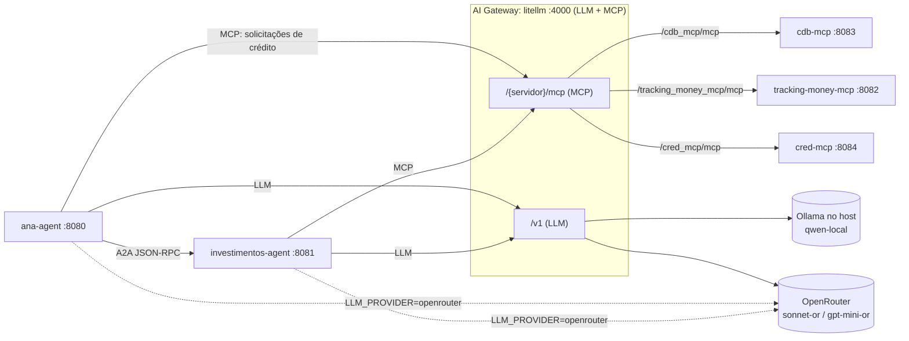

# MCP Gateway com LiteLLM Implementation Plan

> **For agentic workers:** REQUIRED SUB-SKILL: Use superpowers:subagent-driven-development (recommended) or superpowers:executing-plans to implement this plan task-by-task. Steps use checkbox (`- [ ]`) syntax for tracking.

**Goal:** Colocar `cdb-mcp`, `tracking-money-mcp` e `cred-mcp` atrás do LiteLLM. No compose, os agentes passam a acessar as tools sempre pelo gateway (endpoint por servidor e master key).

**Architecture:**
- O LiteLLM (já gateway de LLM) ganha `mcp_servers` no `config.yaml` e expõe `/{servidor}/mcp`.
- Os agentes trocam só as URLs (env do compose) e enviam `x-litellm-api-key`.
- O especialista remove o prefixo `{servidor}-` que o LiteLLM impõe nos nomes das tools (`toolNameMapper` + `filter`), então LLM, prompt e allowlist não mudam.
- Fora do Docker, os `application.yml` continuam apontando direto para os MCPs.

**Tech Stack:** Java 25, Spring Boot 4, LangChain4j 1.20.0 / langchain4j-mcp 1.20.0-beta30, JUnit 5 + AssertJ + Mockito, Maven, Docker Compose, LiteLLM `v1.102.1`.

**Spec:** `docs/superpowers/specs/2026-09-28-mcp-gateway-litellm-design.md`

## Global Constraints

- Imagem do LiteLLM fixada em `ghcr.io/berriai/litellm:v1.102.1`.
- Endpoints do gateway: `http://litellm:4000/cdb_mcp/mcp`, `http://litellm:4000/tracking_money_mcp/mcp`, `http://litellm:4000/cred_mcp/mcp`.
- Aliases dos servidores no LiteLLM: `cdb_mcp`, `tracking_money_mcp`, `cred_mcp`.
- Header de autenticação: `x-litellm-api-key: Bearer <chave>`. Com chave em branco, nenhum header é enviado.
- Variável de ambiente da chave nos agentes: `MCP_GATEWAY_KEY` (compose: `${LITELLM_MASTER_KEY:-sk-litellm-poc}`).
- Propriedades: `mcp.gateway-key: ${MCP_GATEWAY_KEY:}` (investimentos) e `cred.gateway-key: ${MCP_GATEWAY_KEY:}` (ana).
- Os `application.yml` mantêm as URLs diretas `localhost` como default.
- Nomes das tools não mudam no código nem nos prompts. A Ana continua com `TOOL = "consultar_solicitacoes_credito"`.
- Os projetos Maven são independentes (sem parent comum): nada de módulo compartilhado.
- Comentários e nomes no estilo existente: português, sem acentos em comentários Java.
- Maven precisa de JDK 25: prefixe `JAVA_HOME=$HOME/.sdkman/candidates/java/25.0.2-tem` nos comandos `mvn`, ou use `make`.
- Commits terminam com `Co-Authored-By: Claude Opus 5.5 <noreply@anthropic.com>`.

---

## File Structure

| Arquivo | Responsabilidade |
|---|---|
| `investimentos-agent/src/main/java/poc/a2a/investimentos/especialista/NomeTool.java` (novo) | Remover o prefixo `{servidor}-` de um nome de tool |
| `investimentos-agent/src/test/java/poc/a2a/investimentos/especialista/NomeToolTest.java` (novo) | Testes do `NomeTool` |
| `investimentos-agent/src/main/java/poc/a2a/investimentos/especialista/EspecialistaConfig.java` | Header do gateway nos `McpClient` e filtro + mapper no `McpToolProvider` |
| `investimentos-agent/src/test/java/poc/a2a/investimentos/especialista/EspecialistaConfigTest.java` | Casos com nomes prefixados, execução com o nome original e headers |
| `investimentos-agent/src/main/resources/application.yml` | `mcp.gateway-key` |
| `ana-agent/src/main/java/poc/a2a/ana/credito/CredMcpSolicitacoesCredito.java` | Header do gateway no transporte |
| `ana-agent/src/test/java/poc/a2a/ana/credito/CredMcpSolicitacoesCreditoTest.java` | Teste do `cabecalhosGateway` |
| `ana-agent/src/main/java/poc/a2a/ana/config/AnaConfig.java` | Repassar `cred.gateway-key` |
| `ana-agent/src/main/resources/application.yml` | `cred.gateway-key` |
| `docker/litellm/config.yaml` | `mcp_servers` |
| `docker-compose.yml` | Imagem fixada, URLs do gateway, `MCP_GATEWAY_KEY`, `depends_on` |
| `Makefile` | `llm-status` testa o MCP pelo gateway |
| `README.md`, `docs/AI-GATEWAY.md`, `docs/GUIA-TESTES.md` | Diagramas e documentação |

---

### Task 1: `NomeTool.semPrefixo`

**Files:**
- Create: `investimentos-agent/src/main/java/poc/a2a/investimentos/especialista/NomeTool.java`
- Test: `investimentos-agent/src/test/java/poc/a2a/investimentos/especialista/NomeToolTest.java`

**Interfaces:**
- Consumes: nada.
- Produces: `static String NomeTool.semPrefixo(String nome)` (package `poc.a2a.investimentos.especialista`, classe `final`, construtor privado).

- [ ] **Step 0: Criar a branch** (só na primeira task)

```bash
cd /Users/diegolirio/Documents/Github/ai-demos
git checkout main && git pull --ff-only origin main
git checkout -b feat/mcp-gateway-litellm
```

- [ ] **Step 1: Escrever o teste que falha**

```java
package poc.a2a.investimentos.especialista;

import static org.assertj.core.api.Assertions.assertThat;

import org.junit.jupiter.api.Test;

/** O LiteLLM prefixa as tools com "{servidor}-"; o especialista enxerga o nome original. */
class NomeToolTest {

    @Test
    void removeOPrefixoDoServidor() {
        assertThat(NomeTool.semPrefixo("cdb_mcp-listar_posicoes_cdb")).isEqualTo("listar_posicoes_cdb");
        assertThat(NomeTool.semPrefixo("tracking_money_mcp-listar_movimentacoes")).isEqualTo("listar_movimentacoes");
    }

    @Test
    void semHifenDevolveONomeIntacto() {
        assertThat(NomeTool.semPrefixo("listar_posicoes_cdb")).isEqualTo("listar_posicoes_cdb");
    }

    @Test
    void removeSoAtéOPrimeiroHifen() {
        assertThat(NomeTool.semPrefixo("a-b-c")).isEqualTo("b-c");
    }

    @Test
    void nuloOuVazioDevolveOProprioValor() {
        assertThat(NomeTool.semPrefixo(null)).isNull();
        assertThat(NomeTool.semPrefixo("")).isEmpty();
    }
}
```

- [ ] **Step 2: Rodar e ver falhar**

Run: `cd investimentos-agent && JAVA_HOME=$HOME/.sdkman/candidates/java/25.0.2-tem mvn -q test -Dtest=NomeToolTest`
Expected: FAIL, erro de compilação `cannot find symbol ... NomeTool`.

- [ ] **Step 3: Implementação mínima**

```java
package poc.a2a.investimentos.especialista;

/**
 * O LiteLLM (MCP gateway) sempre expoe as tools como "{servidor}-{tool}". O especialista trabalha com o nome
 * original (prompt, allowlist, logs). Seguro porque nenhuma tool dos MCPs da POC tem "-" no nome (usam "_");
 * sem "-", o nome volta intacto (acesso direto ao MCP, fora do compose).
 */
final class NomeTool {

    private NomeTool() {
    }

    static String semPrefixo(String nome) {
        if (nome == null) {
            return null;
        }
        int hifen = nome.indexOf('-');
        return hifen < 0 ? nome : nome.substring(hifen + 1);
    }
}
```

- [ ] **Step 4: Rodar e ver passar**

Run: `cd investimentos-agent && JAVA_HOME=$HOME/.sdkman/candidates/java/25.0.2-tem mvn -q test -Dtest=NomeToolTest`
Expected: PASS (4 testes).

- [ ] **Step 5: Commit**

```bash
git add investimentos-agent/src/main/java/poc/a2a/investimentos/especialista/NomeTool.java \
        investimentos-agent/src/test/java/poc/a2a/investimentos/especialista/NomeToolTest.java
git commit -m "feat(investimentos): NomeTool remove o prefixo do servidor imposto pelo MCP gateway

Co-Authored-By: Claude Opus 5.5 <noreply@anthropic.com>"
```

---

### Task 2: Especialista pelo gateway (filtro, mapper e header)

**Files:**
- Modify: `investimentos-agent/src/main/java/poc/a2a/investimentos/especialista/EspecialistaConfig.java` (beans `cdbMcpClient`, `trackingMoneyMcpClient`, `credMcpClient`, `mcpClient`, `provedorMcp`; imports)
- Modify: `investimentos-agent/src/main/resources/application.yml` (bloco `mcp:`)
- Test: `investimentos-agent/src/test/java/poc/a2a/investimentos/especialista/EspecialistaConfigTest.java`

**Interfaces:**
- Consumes: `NomeTool.semPrefixo(String)` (Task 1).
- Produces:
  - `static Map<String, String> EspecialistaConfig.cabecalhosGateway(String chave)`: `Map.of("x-litellm-api-key", "Bearer " + chave)`, ou `Map.of()` se a chave for nula ou em branco.
  - `static McpToolProvider provedorMcp(McpClient... clients)`: assinatura inalterada.

- [ ] **Step 1: Escrever os testes que falham** (acrescentar em `EspecialistaConfigTest`, mantendo o teste existente)

Imports a adicionar:

```java
import static org.mockito.ArgumentMatchers.any;
import static org.mockito.Mockito.verify;

import dev.langchain4j.agent.tool.ToolExecutionRequest;
import dev.langchain4j.invocation.InvocationContext;
import dev.langchain4j.service.tool.ToolExecutionResult;
import org.mockito.ArgumentCaptor;
```

Novos testes:

```java
    /** Pelo LiteLLM as tools chegam como "{servidor}-{tool}"; o especialista ve os nomes originais. */
    @Test
    void pelosGatewayVeOsNomesSemPrefixoENaoVeOCredito() {
        McpClient cdb = client("cdb-mcp", "cdb_mcp-listar_posicoes_cdb", "cdb_mcp-listar_resgates_cdb");
        McpClient tracking = client("tracking-money-mcp", "tracking_money_mcp-listar_movimentacoes",
                "tracking_money_mcp-consultar_status_transferencia");
        McpClient cred = client("cred-mcp", "cred_mcp-consultar_conta_garantia",
                "cred_mcp-consultar_solicitacoes_credito");

        List<String> nomes = EspecialistaConfig.provedorMcp(cdb, tracking, cred)
                .provideTools(new ToolProviderRequest("ctx-1", UserMessage.from("pedido")))
                .aiServiceTools().stream().map(AiServiceTool::name).toList();

        assertThat(nomes).containsExactlyInAnyOrderElementsOf(EspecialistaConfig.TOOLS_DO_ESPECIALISTA);
    }

    /** O LLM chama o nome limpo; o McpClient recebe o nome real do gateway (com prefixo). */
    @Test
    void executaComONomeOriginalDoGateway() {
        McpClient cdb = client("cdb-mcp", "cdb_mcp-listar_posicoes_cdb");
        when(cdb.executeTool(any(ToolExecutionRequest.class), any(InvocationContext.class)))
                .thenReturn(ToolExecutionResult.builder().resultText("[]").build());

        AiServiceTool tool = EspecialistaConfig.provedorMcp(cdb)
                .provideTools(new ToolProviderRequest("ctx-1", UserMessage.from("pedido")))
                .aiServiceTools().getFirst();
        tool.toolExecutor().execute(ToolExecutionRequest.builder()
                .id("1").name("listar_posicoes_cdb").arguments("{\"customerId\":\"cli-001\"}").build(), "ctx-1");

        ArgumentCaptor<ToolExecutionRequest> requisicao = ArgumentCaptor.forClass(ToolExecutionRequest.class);
        verify(cdb).executeTool(requisicao.capture(), any(InvocationContext.class));
        assertThat(tool.name()).isEqualTo("listar_posicoes_cdb");
        assertThat(requisicao.getValue().name()).isEqualTo("cdb_mcp-listar_posicoes_cdb");
    }

    @Test
    void cabecalhoDoGatewaySoComChave() {
        assertThat(EspecialistaConfig.cabecalhosGateway("sk-x")).containsExactly(
                java.util.Map.entry("x-litellm-api-key", "Bearer sk-x"));
        assertThat(EspecialistaConfig.cabecalhosGateway("")).isEmpty();
        assertThat(EspecialistaConfig.cabecalhosGateway("  ")).isEmpty();
        assertThat(EspecialistaConfig.cabecalhosGateway(null)).isEmpty();
    }
```

- [ ] **Step 2: Rodar e ver falhar**

Run: `cd investimentos-agent && JAVA_HOME=$HOME/.sdkman/candidates/java/25.0.2-tem mvn -q test -Dtest=EspecialistaConfigTest`
Expected: FAIL. `cabecalhosGateway` não compila; depois de criá-lo, `pelosGatewayVeOsNomesSemPrefixo...` falha com lista vazia (o `filterToolNames` descarta os nomes prefixados).

Nota: `McpToolExecutor.execute(request, memoryId)` (1.20.0-beta30) cria um `InvocationContext` não nulo e chama `mcpClient.executeTool(request, invocationContext)`; por isso o `when`/`verify` usa a sobrecarga de dois argumentos.

- [ ] **Step 3: Implementar em `EspecialistaConfig`**

Import a adicionar: `import java.util.Map;`

Substituir os três beans e o `mcpClient`:

```java
    /**
     * DefaultMcpClient conecta no construtor: o MCP precisa estar no ar. No compose a URL e o LiteLLM
     * (MCP gateway, /{servidor}/mcp) e o compose espera ele ficar healthy.
     */
    @Bean(destroyMethod = "close")
    McpClient cdbMcpClient(@Value("${mcp.cdb-url}") String url, @Value("${mcp.gateway-key:}") String gatewayKey) {
        return mcpClient("cdb-mcp", url, gatewayKey);
    }

    @Bean(destroyMethod = "close")
    McpClient trackingMoneyMcpClient(@Value("${mcp.tracking-money-url}") String url,
                                     @Value("${mcp.gateway-key:}") String gatewayKey) {
        return mcpClient("tracking-money-mcp", url, gatewayKey);
    }

    @Bean(destroyMethod = "close")
    McpClient credMcpClient(@Value("${mcp.cred-url}") String url, @Value("${mcp.gateway-key:}") String gatewayKey) {
        return mcpClient("cred-mcp", url, gatewayKey);
    }

    private static McpClient mcpClient(String chave, String url, String gatewayKey) {
        return DefaultMcpClient.builder()
                .key(chave)
                .clientName("investimentos-agent")
                .transport(StreamableHttpMcpTransport.builder()
                        .url(url)
                        .timeout(Duration.ofSeconds(30))
                        .customHeaders(cabecalhosGateway(gatewayKey))
                        .build())
                .toolExecutionTimeout(Duration.ofSeconds(30))
                .build();
    }

    /** Autenticacao no LiteLLM (MCP gateway). Sem chave (acesso direto ao MCP, fora do compose), nenhum header. */
    static Map<String, String> cabecalhosGateway(String chave) {
        return chave == null || chave.isBlank() ? Map.of() : Map.of("x-litellm-api-key", "Bearer " + chave);
    }
```

Substituir o `provedorMcp` (o Javadoc da allowlist fica como está):

```java
    /**
     * failIfOneServerFails=false: um MCP fora não derruba o especialista; a falha vira risk na resposta.
     * Pelo gateway as tools chegam como "{servidor}-{tool}": o filtro roda ANTES do mapper (compara sem prefixo)
     * e o mapper mostra ao LLM o nome original. A execucao usa o nome real (com prefixo), aceito pelo gateway.
     */
    static McpToolProvider provedorMcp(McpClient... clients) {
        return McpToolProvider.builder()
                .mcpClients(clients)
                .failIfOneServerFails(false)
                .filter((client, spec) -> TOOLS_DO_ESPECIALISTA.contains(NomeTool.semPrefixo(spec.name())))
                .toolNameMapper((client, spec) -> NomeTool.semPrefixo(spec.name()))
                .build();
    }
```

Em `investimentos-agent/src/main/resources/application.yml`, no bloco `mcp:`:

```yaml
mcp:
  cdb-url: ${CDB_MCP_URL:http://localhost:8083/mcp}
  tracking-money-url: ${TRACKING_MONEY_MCP_URL:http://localhost:8082/mcp}
  cred-url: ${CRED_MCP_URL:http://localhost:8084/mcp}
  # Chave do LiteLLM (MCP gateway). Vazia = acesso direto ao MCP, sem header (fora do compose).
  gateway-key: ${MCP_GATEWAY_KEY:}
```

- [ ] **Step 4: Rodar e ver passar**

Run: `cd investimentos-agent && JAVA_HOME=$HOME/.sdkman/candidates/java/25.0.2-tem mvn -q test -Dtest=EspecialistaConfigTest`
Expected: PASS (4 testes, incluindo o original `naoExpoeASolicitacaoDeCreditoAoEspecialista`).

- [ ] **Step 5: Rodar a suíte unitária do projeto**

Run: `cd investimentos-agent && JAVA_HOME=$HOME/.sdkman/candidates/java/25.0.2-tem mvn -q test`
Expected: BUILD SUCCESS (inclui as regras ArchUnit).

- [ ] **Step 6: Commit**

```bash
git add investimentos-agent/src/main/java/poc/a2a/investimentos/especialista/EspecialistaConfig.java \
        investimentos-agent/src/main/resources/application.yml \
        investimentos-agent/src/test/java/poc/a2a/investimentos/especialista/EspecialistaConfigTest.java
git commit -m "feat(investimentos): tools MCP pelo LiteLLM (header, filtro e nome sem prefixo)

Co-Authored-By: Claude Opus 5.5 <noreply@anthropic.com>"
```

---

### Task 3: Ana pelo gateway (header no cred-mcp)

**Files:**
- Modify: `ana-agent/src/main/java/poc/a2a/ana/credito/CredMcpSolicitacoesCredito.java:48-57` (`conectandoEm`) e imports
- Modify: `ana-agent/src/main/java/poc/a2a/ana/config/AnaConfig.java:96-100` (bean `solicitacoesCredito`)
- Modify: `ana-agent/src/main/resources/application.yml` (bloco `cred:`)
- Test: `ana-agent/src/test/java/poc/a2a/ana/credito/CredMcpSolicitacoesCreditoTest.java`

**Interfaces:**
- Consumes: nada das tasks anteriores (projeto Maven separado).
- Produces:
  - `public static CredMcpSolicitacoesCredito conectandoEm(String url, Duration timeout, String gatewayKey)`, que substitui a versão de 2 argumentos (único chamador: `AnaConfig`);
  - `static Map<String, String> cabecalhosGateway(String chave)`, com a mesma regra do especialista.

- [ ] **Step 1: Escrever o teste que falha** (acrescentar em `CredMcpSolicitacoesCreditoTest`)

```java
    @Test
    void cabecalhoDoGatewaySoComChave() {
        assertThat(CredMcpSolicitacoesCredito.cabecalhosGateway("sk-x")).containsExactly(
                java.util.Map.entry("x-litellm-api-key", "Bearer sk-x"));
        assertThat(CredMcpSolicitacoesCredito.cabecalhosGateway("")).isEmpty();
        assertThat(CredMcpSolicitacoesCredito.cabecalhosGateway(null)).isEmpty();
    }
```

- [ ] **Step 2: Rodar e ver falhar**

Run: `cd ana-agent && JAVA_HOME=$HOME/.sdkman/candidates/java/25.0.2-tem mvn -q test -Dtest=CredMcpSolicitacoesCreditoTest`
Expected: FAIL, erro de compilação `cannot find symbol ... cabecalhosGateway`.

- [ ] **Step 3: Implementar**

Em `CredMcpSolicitacoesCredito` (o `import java.util.Map;` já existe), substituir `conectandoEm` e adicionar `cabecalhosGateway`:

```java
    /** No compose a URL e o LiteLLM (MCP gateway, /cred_mcp/mcp); a tool continua sendo chamada sem o prefixo. */
    public static CredMcpSolicitacoesCredito conectandoEm(String url, Duration timeout, String gatewayKey) {
        return new CredMcpSolicitacoesCredito(() -> DefaultMcpClient.builder()
                .key("cred-mcp")
                .clientName("ana-agent")
                .transport(StreamableHttpMcpTransport.builder()
                        .url(url)
                        .timeout(timeout)
                        .customHeaders(cabecalhosGateway(gatewayKey))
                        .build())
                .initializationTimeout(timeout)
                .toolExecutionTimeout(timeout)
                .toolExecutionTimeoutErrorMessage(TIMEOUT_SENTINELA)
                .build());
    }

    /** Autenticacao no LiteLLM (MCP gateway). Sem chave (acesso direto ao cred-mcp), nenhum header. */
    static Map<String, String> cabecalhosGateway(String chave) {
        return chave == null || chave.isBlank() ? Map.of() : Map.of("x-litellm-api-key", "Bearer " + chave);
    }
```

Em `AnaConfig`, o bean passa a ser:

```java
    @Bean(destroyMethod = "close")
    CredMcpSolicitacoesCredito solicitacoesCredito(@Value("${cred.mcp-url}") String url,
                                                   @Value("${cred.timeout}") Duration timeout,
                                                   @Value("${cred.gateway-key:}") String gatewayKey) {
        return CredMcpSolicitacoesCredito.conectandoEm(url, timeout, gatewayKey);
    }
```

(Mantenha o Javadoc que já existe acima do bean.)

Em `ana-agent/src/main/resources/application.yml`, no bloco `cred:`:

```yaml
cred:
  # A Ana fala MCP com o cred-mcp (solicitacoes de credito); no compose, pelo LiteLLM (MCP gateway).
  # Conexao preguicosa, nao exige o cred-mcp nem o gateway no startup.
  mcp-url: ${CRED_MCP_URL:http://localhost:8084/mcp}
  timeout: 10s
  # Chave do LiteLLM. Vazia = acesso direto ao cred-mcp, sem header (fora do compose).
  gateway-key: ${MCP_GATEWAY_KEY:}
```

- [ ] **Step 4: Rodar e ver passar**

Run: `cd ana-agent && JAVA_HOME=$HOME/.sdkman/candidates/java/25.0.2-tem mvn -q test`
Expected: BUILD SUCCESS (inclui `CredMcpSolicitacoesCreditoTest` e ArchUnit).

- [ ] **Step 5: Commit**

```bash
git add ana-agent/src/main/java/poc/a2a/ana/credito/CredMcpSolicitacoesCredito.java \
        ana-agent/src/main/java/poc/a2a/ana/config/AnaConfig.java \
        ana-agent/src/main/resources/application.yml \
        ana-agent/src/test/java/poc/a2a/ana/credito/CredMcpSolicitacoesCreditoTest.java
git commit -m "feat(ana): cred-mcp pelo LiteLLM com header de autenticacao do gateway

Co-Authored-By: Claude Opus 5.5 <noreply@anthropic.com>"
```

---

### Task 4: Infra: LiteLLM como MCP gateway no compose

**Files:**
- Modify: `docker/litellm/config.yaml`
- Modify: `docker-compose.yml` (serviços `litellm`, `investimentos-agent`, `ana-agent`)
- Modify: `Makefile` (target `llm-status`)

**Interfaces:**
- Consumes: propriedades `mcp.gateway-key` / `cred.gateway-key` via `MCP_GATEWAY_KEY` (Tasks 2 e 3).
- Produces: endpoints `http://litellm:4000/{cdb_mcp,tracking_money_mcp,cred_mcp}/mcp` (e `localhost:4000` no Mac).

- [ ] **Step 1: `config.yaml`: acrescentar ao final**

```yaml

# MCP gateway: os agentes acessam /{servidor}/mcp com a master key. O LiteLLM prefixa as tools com
# "{servidor}-" (fixo no codigo dele); o especialista remove o prefixo no cliente (NomeTool).
mcp_servers:
  cdb_mcp:
    url: "http://cdb-mcp:8083/mcp"
    transport: "http"
  tracking_money_mcp:
    url: "http://tracking-money-mcp:8082/mcp"
    transport: "http"
  cred_mcp:
    url: "http://cred-mcp:8084/mcp"
    transport: "http"
```

- [ ] **Step 2: `docker-compose.yml`, serviço `litellm`**

Trocar `image: ghcr.io/berriai/litellm:main-stable` por:

```yaml
    # Versao fixa: o MCP gateway do LiteLLM ainda e _experimental (validado no spike com 1.102.1)
    image: ghcr.io/berriai/litellm:v1.102.1
```

Acrescentar ao serviço `litellm` (depois do `healthcheck`):

```yaml
    depends_on:
      cdb-mcp:
        condition: service_healthy
      tracking-money-mcp:
        condition: service_healthy
      cred-mcp:
        condition: service_healthy
```

Atualizar o comentário acima do serviço para:

```yaml
  # AI Gateway self-hosted (docs/AI-GATEWAY.md): LLM (/v1) e MCP (/{servidor}/mcp). O especialista depende dele
  # (conecta nos MCPs no startup); a Ana nao (conexoes preguicosas).
```

- [ ] **Step 3: `docker-compose.yml`, serviço `investimentos-agent`**

Substituir as três URLs MCP por:

```yaml
      # MCP pelo LiteLLM (MCP gateway), endpoint por servidor
      CDB_MCP_URL: http://litellm:4000/cdb_mcp/mcp
      TRACKING_MONEY_MCP_URL: http://litellm:4000/tracking_money_mcp/mcp
      CRED_MCP_URL: http://litellm:4000/cred_mcp/mcp
      MCP_GATEWAY_KEY: ${LITELLM_MASTER_KEY:-sk-litellm-poc}
```

Substituir o `depends_on` inteiro por:

```yaml
    depends_on:
      postgres:
        condition: service_healthy
      litellm:
        condition: service_healthy
```

- [ ] **Step 4: `docker-compose.yml`, serviço `ana-agent`**

Substituir o comentário e a URL do cred-mcp por:

```yaml
      # MCP pelo LiteLLM (solicitacoes de credito). Sem depends_on: a conexao e preguicosa e a Ana sobe sem o gateway.
      CRED_MCP_URL: http://litellm:4000/cred_mcp/mcp
      MCP_GATEWAY_KEY: ${LITELLM_MASTER_KEY:-sk-litellm-poc}
```

- [ ] **Step 5: Validar a sintaxe do compose**

Run: `docker compose config --quiet && echo ok`
Expected: `ok`

- [ ] **Step 6: `Makefile`: `llm-status` testa o MCP pelo gateway**

Substituir as duas últimas linhas do target `llm-status`, de:

```make
		&& code=$$(curl -s -o /dev/null -w '%{http_code}' -m 10 -H "Authorization: Bearer $$LLM_API_KEY" "$$url/models"); \
		echo "GET $$url/models -> HTTP $$code"
```

para:

```make
		&& code=$$(curl -s -o /dev/null -w '%{http_code}' -m 10 -H "Authorization: Bearer $$LLM_API_KEY" "$$url/models"); \
		echo "GET $$url/models -> HTTP $$code"; \
		mcp=$$(curl -s -o /dev/null -w '%{http_code}' -m 10 -X POST http://localhost:4000/cdb_mcp/mcp \
			-H "x-litellm-api-key: Bearer $${LITELLM_MASTER_KEY:-sk-litellm-poc}" -H 'Content-Type: application/json' \
			-H 'Accept: application/json, text/event-stream' \
			-d '{"jsonrpc":"2.0","id":1,"method":"initialize","params":{"protocolVersion":"2025-06-18","capabilities":{},"clientInfo":{"name":"llm-status","version":"0"}}}'); \
		echo "MCP gateway POST http://localhost:4000/cdb_mcp/mcp initialize -> HTTP $$mcp"
```

- [ ] **Step 7: Subir e verificar ponta a ponta**

Run (o Ollama precisa estar no ar: `ollama serve` ou o app):

```bash
cd /Users/diegolirio/Documents/Github/ai-demos/agent-to-agent
make up
make llm-status
```

Expected:
- todos os serviços `Healthy`;
- `llm-status` com `HTTP 200` no `/v1/models` e `MCP gateway ... initialize -> HTTP 200`;
- os agentes com `CDB_MCP_URL`/`CRED_MCP_URL` apontando para o LiteLLM (conferir com `docker compose exec -T investimentos-agent printenv | grep MCP`).

- [ ] **Step 8: Conferir as tools pelo gateway**

Run:

```bash
curl -s -X POST http://localhost:4000/cred_mcp/mcp -H 'x-litellm-api-key: Bearer sk-litellm-poc' \
  -H 'Content-Type: application/json' -H 'Accept: application/json, text/event-stream' \
  -d '{"jsonrpc":"2.0","id":1,"method":"tools/call","params":{"name":"consultar_solicitacoes_credito","arguments":{"customerId":"cli-009"}}}' \
  | sed -n 's/^data: //p;/^{/p' | jq -c '.result.content[0].text // .error' | cut -c1-120
```

Expected: JSON com `sol-009` e `RECUSADA`. Se o gateway exigir sessão (`initialize` antes), repita com `initialize` + header `mcp-session-id`, como no `llm-status`.

- [ ] **Step 9: Smoke**

Run: `make smoke`, seguido de `docker compose logs --since 30m litellm | grep -ciE 'tools/call|call_tool|mcp'` e `docker compose logs --since 30m investimentos-agent ana-agent | grep -iE '401|Unauthorized|Connection refused|mcp.*(erro|falha)'`
Expected:
- o LiteLLM registra chamadas MCP (contador > 0);
- nenhuma linha com `401`, `Unauthorized` ou `Connection refused` nos agentes;
- falhas do smoke atribuíveis ao modelo 7b (timeouts do LLM, tool não chamada) são aceitas e registradas; falhas de conexão ou autenticação MCP, não.

- [ ] **Step 10: Commit**

```bash
git add docker/litellm/config.yaml docker-compose.yml Makefile
git commit -m "feat(ai-gateway): LiteLLM como MCP gateway para cdb, tracking-money e cred

Co-Authored-By: Claude Opus 5.5 <noreply@anthropic.com>"
```

---

### Task 5: Documentação e diagramas

**Files:**
- Modify: `README.md` (diagramas no topo, linhas 7-40 aprox.)
- Modify: `docs/AI-GATEWAY.md` (nova seção "MCP Gateway" antes de "7. Próximos passos")
- Modify: `docs/GUIA-TESTES.md` (seção 1, depois do bloco `make llm-*`)

**Interfaces:**
- Consumes: endpoints e comportamento das Tasks 2–4.
- Produces: nada de código.

- [ ] **Step 1: README: diagrama ASCII**

Substituir o bloco ASCII do topo (de `cliente ─POST /chat─▶` até a linha `└─▶ OpenRouter (sonnet-or, gpt-mini-or)`) por:

```
cliente ─POST /chat─▶ ana-agent:8080 ─A2A JSON-RPC─▶ investimentos-agent:8081
                          │                                   │
                          │ MCP (solicitações de crédito)     │ MCP (cdb, tracking-money, cred)
                          ▼                                   ▼
                 ┌──────────────── litellm:4000 (AI Gateway) ────────────────┐
                 │ MCP  /cdb_mcp/mcp ─────────────▶ cdb-mcp:8083              │
                 │      /tracking_money_mcp/mcp ──▶ tracking-money-mcp:8082   │
                 │      /cred_mcp/mcp ────────────▶ cred-mcp:8084             │
                 │ LLM  /v1 ─┬─▶ Ollama (host, qwen-local)                    │
                 │           └─▶ OpenRouter (sonnet-or, gpt-mini-or)          │
                 └────────────────────────────────────────────────────────────┘
ana-agent + investimentos-agent ─LLM─▶ litellm:4000/v1   (ou OpenRouter direto com LLM_PROVIDER=openrouter)
```

- [ ] **Step 2: README: diagrama Mermaid**

Substituir o bloco ```` ```mermaid ```` inteiro por:

````markdown

````

Conferir a renderização colando o bloco em https://mermaid.live (sem erro de sintaxe).

- [ ] **Step 3: `docs/AI-GATEWAY.md`: seção nova**

Inserir antes de `## 7. Próximos passos` (e ajustar o status no topo para citar o MCP gateway):

```markdown
## 6.1 MCP Gateway (LiteLLM na frente dos MCP servers)

No compose, os agentes acessam `cdb-mcp`, `tracking-money-mcp` e `cred-mcp` **sempre pelo LiteLLM**, que passa a ser o gateway único de LLM e MCP. Design: [2026-09-28-mcp-gateway-litellm-design.md](superpowers/specs/2026-09-28-mcp-gateway-litellm-design.md).

| Aspecto | Como ficou |
|---|---|
| Endpoints | Um por servidor: `/cdb_mcp/mcp`, `/tracking_money_mcp/mcp`, `/cred_mcp/mcp`. Mantém um `McpClient` por MCP e o isolamento de falha (`failIfOneServerFails(false)`) |
| Autenticação | Master key (`LITELLM_MASTER_KEY`) no header `x-litellm-api-key: Bearer ...`. Sem ela: 401 |
| Nomes das tools | O LiteLLM **sempre** prefixa (`cdb_mcp-listar_posicoes_cdb`), fixo no código dele. O especialista remove o prefixo no cliente (`NomeTool` + `toolNameMapper`), então LLM, prompt e allowlist não mudam; a execução usa o nome com prefixo. A Ana chama `consultar_solicitacoes_credito` sem prefixo, que o gateway aceita |
| Dependências | O especialista espera o LiteLLM healthy (conecta nos MCPs no startup); o LiteLLM espera os três MCPs. A Ana não depende (conexão preguiçosa) |
| Fora do Docker | `make run-*` e os testes de integração continuam direto nos MCPs (`localhost`), sem header |
| Versão | Imagem fixada em `v1.102.1`: o MCP gateway do LiteLLM está em `_experimental` |

**Evidências do spike (LiteLLM 1.102.1):** `initialize`, `tools/list` e `tools/call` funcionam pelo gateway nos três MCPs (Streamable HTTP, SDK Java 2.0.1). `tools/call` aceita nome com e sem prefixo, com o mesmo resultado da chamada direta.

**Limites conhecidos:**
- Os MCPs continuam alcançáveis diretamente pela rede do compose; o gateway não é imposto pela rede.
- Os dois agentes usam a mesma chave, então qualquer um enxerga os três servidores.
```

Na tabela da seção 7, trocar a linha "Controle de acesso por aplicação" por:

```markdown
| Controle de acesso por aplicação | Uma virtual key do LiteLLM por agente, limitando modelos e **servidores MCP** (Ana só em `cred_mcp`; especialista nos três) |
```

e acrescentar a linha:

```markdown
| Impor o gateway | Rede Docker separada: MCPs só na rede do LiteLLM, agentes sem rota direta para eles |
```

- [ ] **Step 4: `docs/GUIA-TESTES.md`**

Depois do bloco de comandos `make llm-*` da seção 1, acrescentar:

````markdown
As tools MCP também passam pelo LiteLLM (`/{servidor}/mcp`). Para listar as do cred-mcp pelo gateway:

```bash
curl -s -X POST http://localhost:4000/cred_mcp/mcp -H 'x-litellm-api-key: Bearer sk-litellm-poc' \
  -H 'Content-Type: application/json' -H 'Accept: application/json, text/event-stream' \
  -d '{"jsonrpc":"2.0","id":1,"method":"tools/list"}' | sed -n 's/^data: //p;/^{/p' | jq -c '[.result.tools[].name]'
# ["cred_mcp-consultar_conta_garantia","cred_mcp-consultar_solicitacoes_credito"]  (prefixo do gateway)
```
````

(Se `tools/list` exigir `initialize` antes, acrescente-o no exemplo com o `mcp-session-id` devolvido, e confira executando o comando.)

- [ ] **Step 5: Commit**

```bash
git add README.md docs/AI-GATEWAY.md docs/GUIA-TESTES.md
git commit -m "docs(ai-gateway): MCP gateway no LiteLLM, diagramas do README e guia

Co-Authored-By: Claude Opus 5.5 <noreply@anthropic.com>"
```

---

### Task 6: Verificação final

- [ ] **Step 1: Unitários dos serviços**

Run: `make test`
Expected: os 5 serviços com BUILD SUCCESS.

- [ ] **Step 2: Conferir que nada ficou apontando direto no compose**

Run: `grep -nE '_MCP_URL: http://(cdb|tracking|cred)-' docker-compose.yml || echo "nenhuma URL MCP direta"`
Expected: `nenhuma URL MCP direta`.

- [ ] **Step 3: Estado do git**

Run: `git status --short && git log --oneline main..HEAD`
Expected: árvore limpa (exceto `ana-agent/archunit_store/`, que já era não rastreada) e 5 commits das Tasks 1–5.
